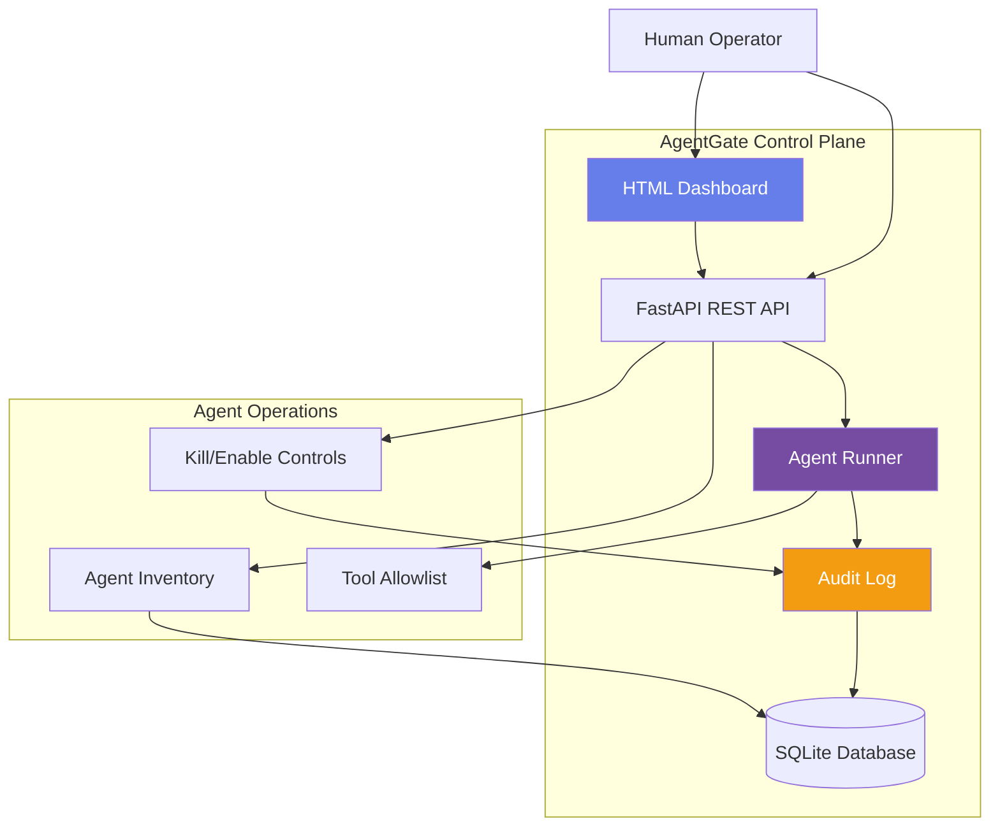

# AgentGate

**Agent-level control plane for coding agents**

Built by **Shriprasad Patil** | MCA Student, Bangalore  
Companion project to [CodeForge-AI](https://github.com/Shriprasad-P/CodeForge-AI) - secure cloud runtime for coding agents

[](https://github.com/Shriprasad-P/AgentGate/actions)
[](https://www.python.org/downloads/)
[](https://opensource.org/licenses/MIT)

---

## Why This Exists

I'm building **CodeForge-AI** (also called **AgentDock**): a secure cloud runtime for coding agents. That handles the *execution* layer — sandboxed containers, resource limits, isolation.

But there's a missing operational layer: **which agents are live, which tools they may call, and how a human kills one mid-run with an audit trail.**

Model-level OpenAI proxies are common (LiteLLM, etc.). **Agent-level control planes are not.**

AgentGate is that control plane — a small, interviewable prototype that demonstrates:

- **Inventory management** for agents, not just API keys
- **Fail-closed kill switch** that denies tool calls immediately
- **Tool-level allowlisting** per agent (e.g., files+git only, no shell)
- **Append-only audit log** for compliance and debugging

This is **not** a generic LLM gateway. It's **not** LangSmith (observability). It's **not** a fake bank product.

It's inspired by human-in-command / kill-switch requirements emerging in India's 2025–26 AI governance discussion (MeitY AI guidelines, RBI draft MRMF on algorithmic accountability) — applied specifically to **coding agents** that can run shell commands, modify code, and push to production.

---

## Architecture



### Core Concepts

**Unit of control = Agent** (not model, not user)

Each agent has:
- Identity: `name`, `owner`, `purpose`
- Risk classification: `low` / `medium` / `high`
- Status: `enabled` | `killed` (fail-closed)
- Tool allowlist: subset of `{shell, git, files, network, browser}`
- Optional: `model_name` it may call

**Kill is fail-closed:**  
When an agent is killed, **all tool calls are immediately denied** with audit events. The agent cannot recover without explicit human re-enablement.

**Audit is append-only:**  
Every operation (register, kill, enable, tool_call, tool_denied, chat) creates an immutable audit entry with timestamp and trigger source.

---

## What's Different From an LLM Gateway?

| Feature | LLM Gateway (LiteLLM, etc.) | AgentGate |
|---------|----------------------------|-----------|
| **Unit of control** | API key / model | **Agent identity** |
| **What it controls** | Model routing, rate limits | **Tool execution permissions** |
| **Kill switch** | Rate limit to zero | **Immediate tool denial** |
| **Audit scope** | Token usage, costs | **Tool calls, denials, kills** |
| **Use case** | Model abstraction, cost control | **Agent ops, compliance, safety** |

AgentGate is **upstream** of model calls — it controls whether a coding agent can `shell.exec("rm -rf")` or `git.push`, not which LLM it talks to.

---

## Demo Agents (Pre-seeded)

| Name | Owner | Purpose | Tools Allowed | Risk |
|------|-------|---------|---------------|------|
| `forge-coder` | platform | Isolated code edits in sandboxed environments | `files`, `git`, `shell` | HIGH |
| `doc-weaver` | platform | Documentation generation and maintenance | `files` | MEDIUM |
| `web-scout` | platform | Web research and data gathering | `network`, `browser` | HIGH |

---

## 5-Minute Click Demo

**Prerequisites:** Docker, or Python 3.12 + venv

### Option 1: Docker (Recommended)

```bash
git clone https://github.com/Shriprasad-P/AgentGate.git
cd AgentGate
cp .env.example .env
docker compose up --build
```

Open http://localhost:8000

### Option 2: Local venv

```bash
git clone https://github.com/Shriprasad-P/AgentGate.git
cd AgentGate
python3.12 -m venv venv
source venv/bin/activate  # Windows: venv\Scripts\activate
pip install -r requirements.txt
cp .env.example .env
uvicorn app.main:app --reload
```

Open http://localhost:8000

### Interactive Demo Steps

1. **View the agent inventory** — 3 pre-seeded agents
2. **Click "Run Demo" on `forge-coder`** — type a task like "Check git status and read the config file"
3. **Observe tool calls execute successfully** (green checkmarks in modal)
4. **Scroll down to Audit Log** — see `TOOL_CALL` events
5. **Click "Kill" on `forge-coder`** — confirm the action
6. **Click "Run Demo" again with the same task**
7. **Observe all tool calls are DENIED** (red, "Agent is killed")
8. **Check Audit Log** — see `KILL` event and `TOOL_DENIED` events
9. **Click "Enable"** — agent is restored
10. **Run demo again** — tools work again

**That's the kill switch in action.**

---

## API Quick Reference

### Agent Management

```bash
# List all agents
curl http://localhost:8000/api/agents

# Get specific agent
curl http://localhost:8000/api/agents/1

# Create agent (requires auth)
curl -X POST http://localhost:8000/api/agents \
  -H "Authorization: Bearer dev-token-change-me" \
  -H "Content-Type: application/json" \
  -d '{
    "name": "my-agent",
    "owner": "alice",
    "purpose": "Code review automation",
    "risk_tier": "medium",
    "tools_allowed": ["files", "git"],
    "model_name": "gpt-4"
  }'
```

### Agent Control

```bash
# Kill an agent (fail-closed)
curl -X POST http://localhost:8000/api/agents/1/kill

# Enable a killed agent
curl -X POST http://localhost:8000/api/agents/1/enable

# Run agent task (simulated)
curl -X POST http://localhost:8000/api/agents/1/run \
  -H "Content-Type: application/json" \
  -d '{"task": "Read config file and commit changes"}'
```

### Audit Logs

```bash
# List recent audit events
curl http://localhost:8000/api/audit?limit=50

# Filter by agent
curl http://localhost:8000/api/audit?agent_id=1
```

### OpenAI-Compatible Chat (Optional)

```bash
curl -X POST http://localhost:8000/v1/chat/completions \
  -H "Authorization: Bearer dev-token-change-me" \
  -H "Content-Type: application/json" \
  -d '{
    "model": "gpt-4",
    "messages": [{"role": "user", "content": "Hello"}],
    "agent_id": 1
  }'
```

---

## Testing

```bash
# Run all tests
pytest

# Run with coverage
pytest --cov=app tests/

# Run specific test file
pytest tests/test_control.py -v
```

**Test Coverage:**

- ✅ Killed agent cannot execute tools
- ✅ Enable restores tool execution
- ✅ Disallowed tools are denied with audit
- ✅ Audit log has no DELETE (append-only)
- ✅ Demo runs write `tool_call` events
- ✅ Kill/enable create audit trail
- ✅ Chat endpoint checks agent status

All tests run automatically on push via GitHub Actions.

---

## Project Structure

```
agentgate/
├── app/
│   ├── __init__.py
│   ├── main.py              # FastAPI app + endpoints
│   ├── database.py          # SQLAlchemy models
│   ├── schemas.py           # Pydantic schemas
│   ├── runner.py            # Simulated agent runner
│   ├── config.py            # Configuration
│   └── templates/
│       └── dashboard.html   # Jinja2 dashboard
├── tests/
│   ├── conftest.py
│   ├── test_agents.py       # Agent CRUD tests
│   ├── test_control.py      # Kill/enable tests
│   ├── test_runner.py       # Tool execution tests
│   ├── test_audit.py        # Audit log tests
│   └── test_chat.py         # Chat endpoint tests
├── .github/workflows/
│   └── test.yml             # CI pipeline
├── docker-compose.yml
├── Dockerfile
├── requirements.txt
├── requirements-dev.txt
├── .env.example
├── pytest.ini
├── LICENSE                  # MIT
└── README.md
```

---

## Tech Stack

- **Python 3.12** — Modern Python with type hints
- **FastAPI** — Async REST API framework
- **SQLAlchemy** — ORM with SQLite backend
- **Pydantic** — Request/response validation
- **Jinja2** — Server-rendered dashboard (no React SPA)
- **pytest** — Comprehensive test suite
- **Docker Compose** — One-command deployment
- **GitHub Actions** — Automated testing on Python 3.12

---

## Honest Limitations

This is a **resume/interview project**, not production software:

1. **Simulated runner** — Tool execution is mocked. In production, this would integrate with AgentDock's container runtime.
2. **Single-instance SQLite** — Production would use Postgres with replication.
3. **No authentication system** — Dashboard is open (for demo ease). Production needs RBAC, SSO, API key rotation.
4. **No horizontal scaling** — This is a single-process FastAPI app.
5. **No real LLM calls** — Chat endpoint returns mock responses.
6. **Not connected to production AgentDock yet** — That integration is the next phase.

**What this DOES prove:**
- Clean FastAPI architecture
- Fail-closed safety controls
- Append-only audit design
- Testable, interviewable code
- Understanding of agent ops vs. model ops

---

## Roadmap (Future Work)

- [ ] Integrate with real AgentDock container runtime
- [ ] Add webhook support for kill switch triggers
- [ ] Multi-tenant support with team isolation
- [ ] Tool-call approval workflows (human-in-the-loop)
- [ ] Postgres backend with audit log retention policies
- [ ] Grafana dashboard for agent metrics
- [ ] OAuth2 + RBAC for production auth

---

## Why This Matters (Governance Context)

India's Ministry of Electronics and IT (MeitY) published AI safety guidelines in early 2025, emphasizing:
- **Human oversight** of automated systems
- **Audit trails** for algorithmic decisions
- **Kill switches** for high-risk AI applications

The Reserve Bank of India's draft Model Risk Management Framework (MRMF 2026) adds:
- **Tool-level controls** for AI agents in financial systems
- **Fail-closed defaults** when anomalies are detected

AgentGate applies these principles to **coding agents** — which can modify code, run shell commands, and push to production. Traditional LLM gateways don't address this operational layer.

**This is not an RBI-certified product.** No bank uses this. But it demonstrates the control plane architecture that such requirements would demand.

---

## Contributing

This is a personal resume project, but suggestions are welcome:

1. Fork the repo
2. Create a feature branch (`git checkout -b feature/your-idea`)
3. Add tests for your changes
4. Ensure `pytest` passes
5. Submit a pull request

---

## License

MIT License — see [LICENSE](LICENSE) for details.

---

## Contact

**Shriprasad Patil**  
MCA Student | Bangalore, India  
Building secure infrastructure for AI coding agents

- GitHub: [Shriprasad-P](https://github.com/Shriprasad-P)

**Related Projects:**
- **[CodeForge-AI](https://github.com/Shriprasad-P/CodeForge-AI)** — Secure cloud runtime for coding agents (sandboxed containers, execution layer)
- **AgentGate** (this repo) — Control plane for agent operations (kill switch, audit, tool allowlist)

---

## Acknowledgments

Inspired by:
- **LangSmith** (observability, but not ops control)
- **Airplane.dev** (approval workflows for internal tools)
- **RBI MRMF Draft** (model risk management principles)
- **MeitY AI Guidelines 2025** (human-in-command requirements)

Built as a complement to AgentDock, not a replacement for LLM gateways. AgentGate is **upstream** of model calls — it controls *what agents can do*, not *which model they use*.

---

**⚡ Clone, run, click Kill, watch the audit log. That's the demo.**
